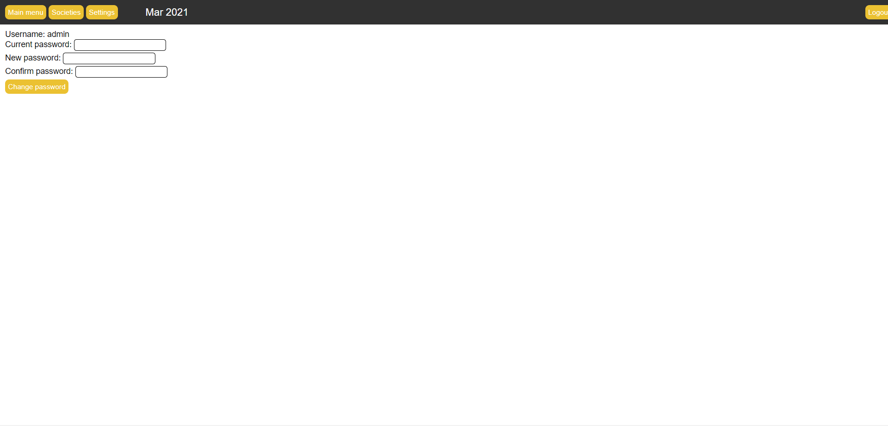

# Calendar System
A-level project for a calendar system which allows a user to add information for events and societies for a college website. 
The information should then be displayed to inform students of the opportunities that are available to them.

## Setup
To run the website on your local machine, you can install XAMPP so you can run PHP code and setup the database, 
which you can do so by following [this tutorial](https://youtu.be/XBj_le81sAc?t=382).

After starting the `Apache` and `MySQL` modules on XAMPP, you can set up the database by entering `localhost/phpmyadmin/` in your URL bar, 
create a new database and import `calendarsystem.sql` into it, which is a series of SQL queries/template for recontructing the database I created.

Ensure you have put this cloned repository in `xampp/hdoc/`, then enter `localhost/Calendar-System/index.php` in your URL bar to view the website.

## Note
A user will only be able to perform create, write and delete actions if they are logged in to the system. 
A normal visitor to the website, say a student, will only be able to view the events.

## Core Functionalities

### Login system
Credentials for logging in to the calendar system:
username: `admin`

password: `admin123`

### Main menu
This page displays the events, clicking on a date label on the calendar displays 
a form for the user to add details for an event

Clicking on an existing event displays more details about them

Clicking on the edit button allows you to modify the details

### Societies
Clicking on a society name label displays its details in a form for you to update

### Settings
This page allows the user to change their password